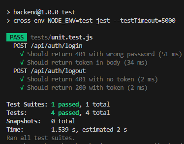

# curly-octo-computing-machine

## Stackki:

### API

**Node.js - Express.js - MongoDB**

Kirjastot:

* Bcryptjs
* Cors
* Nodemon
* Cross-env
* dotenv
* jest
* supertest
* jsonwebtoken
* mongodb
* mongoose

### Toiminnalisuus:

#### Backend API

* Serveri pyörii API-end pointtina.
* Luo randomisoidun autentikaatio tokenin käyttäen crypto.js (randomisointi) ja jsonwebtoken kirjastoa.
* Kirjautuessa oikeilla käyttäjätunnuksilla lähettää `HTTP: POST` pyyntöön vastauksena tokenin.
* Hakee tallennetut tiedot MongoDB tietokannasta.
* Kolme Mongoose Scheemaa: `Users, Products, Customers`.
* User schema: toimii aplikaation käyttäjänä, joka on esiasettu tietokantaan, apissa ei ole reittiä uuden käyttäjän luomiseen.
* Product schema: Tuotteiden tiedot, scheman mukaisesti generoitu valmiiksi tuotteita tietokantaan, ei ole reittiä luoda uusia tuotteita.
* Customer schema: Käyttäjän asiakkaiden tiedot, generoitu pari asiakasta valmiiksi tietokantaa, ei ole reittiä luoda uusia.
* Reitit: Kaikki menee routerin mukaan: `host:/api/`, nykyisellään on kolme pää reittiä `/api/auth`, `api/customers` ja `api/products`.
* `api/auth` alta löytyy `POST` tyyppiset `login` ja `logout`, näillä hoidetaan kirjautuminen ja nämä hoitaa autentikatioon. Routterin määrittämisessä jäi lisäämättä tokenin vaatiminen tuotteille ja asiakkaille.
* Kaikki kutsut apille toimii `POST` tyyppisesti ja vastausta pyyntöön käytetään emberin puolella.
* Kaikki vastaukset on pyritti rakentamaan `JSON API` mallin mukaan, jolloin emberin on helppo käsitellä apilta saatua tietoa.
* API Hoitaa myös allennusten laskemisen, ja laskenta tapahtuu `controllers/customerprices.js` olevilla funktioilla. Siellä on huonnon mallin mukaisesti kova koodattuna logiikkaa.

#### Frontend

**Ember.js**

Hitti vai huti? Jonkun näköinen yritys ottaa haltuun todella lyhyessä ajassa aivan vierasta frameworkkia (`ember.js`).
Perus toiminnallisuus: Käyttäjä menee palveluun ja häneltä vaaditaan kirjautuminen ensin. Kaikki reitit on kirjautumisen takana. Autentikaatio tapahtuu `simpleAuth` avulla, ja sessio tokenin haetaan kirjautessa API:lta. Ulos kirjautuminen poistaa tokenin ja lopettaa session. Kirjautunut käyttäjä on tallennettuna `current-user.js` servicessä.
Asiakkaat haetaan fetch Apilla siirtyessä `/customers` urliin ja tallenetaan `customer modeliin`. Customer modelia käytetään paikoissa joissa tarvitaan asiakkaiden dataa, kuten `customers` templatella ja `customer` komponenteissa.
Siirtyessä asiakas sivulle näytetään modelista ladatut asiakkaat ja valitaan niistä haluttu. Valinnan jälkeen on urli: `customers/:id` ja valitun asiakkaan tiedot renderöidään näytöllä, samalla ilmestyy valinnat alennusten näyttämiseen: {"Time of Year Discount", "Sales History Discount" "Special Discount Amount:"} ja painike "apply discounts".
Painamalla painiketta aktivoituu `@action applyDiscounts` kontrollerista, joka antaa parametrit eteenpäin `product-data` servicelle, mistä lähtee API-kutsun backkärille, vastaus data tulee kontrollerilta takaisin templatelle, mikä renderöi tuotteet(nimi, hinta, kokonaisalennus %, ja eri alennus tyyppien %:t).
Alennukset on ehdollisia parametrejä, joten voit hakea ilman alennuksia, tai valita haluamasi alennustyypit aktiiviseksi ja hakea uudet hintatiedot.


#### Testaus

Emberin puolella `ember-cli` testaus nätti todella näppärältä, mutten ehtinyt siihen perehtyä valitettavasti. Node.js backendin autentikaatiolle simppeli `unit-test`:

```js
const mongoose = require("mongoose");
const request = require("supertest");
const app = require("../app");

require("dotenv").config();

let originalLog;
let token;
let db;

beforeAll(async () => {
    originalLog = console.log;
    console.log = jest.fn();
  
    // Close existing connections
    if (mongoose.connection.readyState === 1) {
      await mongoose.connection.close();
    }
  
    // Connect to test database
    db = await mongoose.connect(process.env.MONGO_URI, {
      useNewUrlParser: true,
      useUnifiedTopology: true,
    });
  
    const response = await request(app).post("/api/auth/login")
    .send({
          username: "testuser",
          password: "password",
      });
    token = response.body.data.token;
  });
  

  afterAll(async () => {
    console.log = originalLog;

    if (mongoose.connection.readyState === 1) {
      await mongoose.connection.close();
    }
  });

describe("POST /api/auth/login", () => {
    it("Should return 401 with wrong password", async () => {
        const response = await request(app).post("/api/auth/login").send({
            username: "testuser",
            password: "wrongpassword",
        });
        expect(response.statusCode).toBe(401);
    });

    it("Should return token in body", async () => {
        const response = await request(app).post("/api/auth/login").send({
            username: "testuser",
            password: "password",
        });
        expect(response.statusCode).toBe(200);
        expect(response.body.data).toHaveProperty('token');
    });
});

describe("POST /api/auth/logout", () => {
    it("Should return 401 with no token", async () => {
        const response = await request(app).post("/api/auth/logout");
        expect(response.statusCode).toBe(401);
    });

    it("Should return 200 with token", async () => {
        const response = await request(app).post("/api/auth/logout").set('authorization-token', `token: ${token}`);
        console.log(token);
        expect(response.statusCode).toBe(200);
    });
});
```



### Kehityskohteita

## Koodikäytänteet

* Useissa paikkoissa jäi vielä turhan isoja kokonaisuuksia, joita olisi voinut pilkkoa pienempiin osiin koodin luettavuuden ja uudelleen käytetävyyden kannalta. Esimerksi: `Backend/Routes` tiedostoissa polkujen määritys jää epäselväksi, jos polkuja tulee paljon lisää. Näistä olisi voinut irrottaa logiikan omaan `controllers` kansion alle.
* **Koodin kommentointi:** Jäi osittain aika vähälle, olisi ollut hyvä kommentoida mitä muista kansioista/tiedostoista importatut muuttujat sisältää.
* Modulaarisuus on mielestäni kohtuullisen hyvin toteuttu, mutta aina sitä voisi parantaa esimerkiksi uudelleen käytettävät komponentit kuten painikkeet komponenteiksi. Helpottaa tyylittelyiden ylläpitoa.
* Muuttujien nimeämiset olisi osassa kohdassa voinut olla paremmin kuvaavia.
* Koodin jäi kovakoodattuja osuuksia, joiden olisi syytä olla muuttujien alla.
* Ylimääräisiä debuggaus `console.log()` jäi koodin sekaan.

 ## Suorituskyky

 * Aplikaatio pyörii suhteellisen mukavasti, ei mielestäni kauheita mokia tässä. (Poikkeuksena: Asiakas sivulla asiakasta valitessa, lähetätään api kutsu aina. Tämä on aivan turhaa, sillä asiakas tiedot on jo ladattu `modeliin`, eikä asiakaan tiedot muutu välissä. Suunnittelu virhe.)

## Turvallisuus
* Backendin puolelle pitäisi määrittää `authenticateJWT` middleware käyttöön kaikille poluille kirjautumisen jälkeen ja lisätä frontin api kutsujen headereihin: `authentication-token`. Toiminallisuus on olemassa, mutta unohtui devatessa määrittää nuo käyttöön.
* Käyttäjä inputtien validointi regexillä.

## Aplikaation suunnittelu

* Tässä mentiin enemmän metodilla "katsotaan mitä kykenen emberillä tekemään" metodilla.
* Feature ehdotus: Uusien asiakkaiden lisääminen tietokantaan käyttöliittymästä, nykyisten asiakkaiden tietojen päivitys sekä poistaminen.
* Feature ehdotus: Uusien tuotteiden lisääminen tietokantaan käyttöliitymästä, nykyisten tuotteiden tietojen päivitys sekä poistaminen.
* Feature ehdotus: Hinnoittelu parametrien muokkaaminen tulisi onnistua käyttöliittymän kautta.
* Feature ehdotus: Alennushinnoittelu tietoja pitäisi voida tallentaa tietokantaan, jotta niihin pääsee käsiksi myöhemminkin.
* Feature ehdotus: Kooste alennus hinnoista asiaakkalle ulos aplikaatiosta, vaikka .csv formaatissa.

## Muita huomioita
* Mongoose schema ja ember modelien attribuuttien tyyppien yhteinäinen määrittely.

